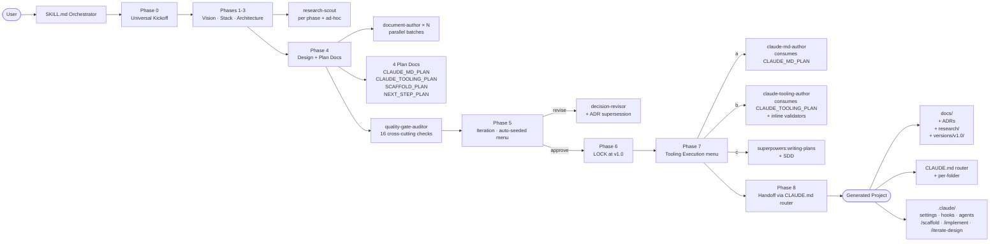

<!--
Author: Alexander Ford <alex@pseudo-lang.com>
Repository: https://github.com/alexander-ford-ventures/project-architect
License: MIT
-->

<p align="center">
  
</p>

<div align="center">

# project-architect

**An orchestrator skill that bootstraps any project end-to-end inside Claude Code.**

From _"I want to build X"_ to _"docs, CLAUDE.md, ADRs, and a `.claude/` config — all committed."_

[](LICENSE)
[](https://github.com/alexander-ford-ventures/project-architect/releases)
[](https://github.com/alexander-ford-ventures/project-architect)
[](https://github.com/alexander-ford-ventures/project-architect/commits/main)
[](.claude-plugin/plugin.json)
[](tests/)

</div>

---

## What's new in v3.1.0 _(2026-05-20)_

Minor release. **Universal research checklist** for every `research-scout` dispatch (no more relying on stale training data for vendor facts) + the full **Alex Ford Labs brand-asset kit** at `.github/assets/brand/`. Backward-compatible — same 11-phase orchestrator, same 6 subagents, same 16-check auditor, same state schema.

| Area | What it ships |
|---|---|
| **Universal research checklist** | Every research-scout dispatch (phase + ad-hoc) MUST cover four bases: (1) latest official docs, (2) `<docs-root>/llms.txt` + `llms-full.txt` per [llmstxt.org](https://llmstxt.org/), (3) best practices via web search, (4) 3–5 similar projects / prior art. Encoded in `agents/research-scout.md` (new "Universal first-pass" section) and `skills/project-architect/references/research-prompts.md` (new "Universal research checklist" ToC entry). |
| **Alex Ford Labs brand kit** | 50 files at `.github/assets/brand/` — lockup, mark, wordmark, social-preview, in light + dark. Geist Mono ExtraBold display, V5 palette (pure B&W). SVGs outline-converted via fontTools (no font dependency at render time); PNGs at standard resolutions (favicon 16–512, Apple touch 180, GitHub avatar 460, social 1280×640). |
| **Test coverage** | **69 test files** (was 68 at v3.0.0). +1 for the universal-checklist rule. The version-bump release gate retired-and-replaced (`test_v30_version_bump.sh` → `test_v31_version_bump.sh`). |
| **Removed** | `.github/assets/alexander-ford-ventures-logo.svg`, `.github/social-preview.py`, `.github/social-preview.png` — all superseded by the new brand kit. |
| **Archived** | `.github/assets/logo-concepts/` → `.github/assets/_archive/logo-concepts/` (7 concepts + AF/LABS font-width matrix, parked for later reference). |

**Why the research rule?** Vendor docs and best practices evolve faster than any LLM's training data. Mandating `llms.txt` / `llms-full.txt` as the first `WebFetch` shifts the scout from "recall from training" to "fetch current source-of-truth". Downstream ADRs become defensible against "you wrote this from stale training data" objections.

**Migration from v3.0.0** — Forward-compatible. Existing `state.json` files work without modification. The new research rule applies to **new** dispatches; cached findings from older runs are not retroactively re-fetched.

```bash
bash tests/run_all.sh
# Test files passed: 69 · All tests passed.
```

<details>
<summary>v3.0.0 — Repository move + author handover _(2026-05-19)_</summary>

**Repository move + author handover.** Major release; identity change only — no behaviour, API, or schema changes. Same 11-phase orchestrator, same 6 specialised subagents, same 16-check quality-gate auditor, same 68 tests still green.

| Area | What changed |
|---|---|
| **Canonical repository** | `siliconyouth/project-architect` → [`alexander-ford-ventures/project-architect`](https://github.com/alexander-ford-ventures/project-architect). The old GitHub repo is kept as a mirror but new installs should target the alexander-ford-ventures org. |
| **Marketplace identifier** | `project-architect@siliconyouth` → `project-architect@alexander-ford-ventures`. The marketplace `name` field in `.claude-plugin/marketplace.json` was renamed. |
| **Author / maintainer** | Vladimir Dukelic `<vladimir@dukelic.com>` → **Alexander Ford** `<alex@pseudo-lang.com>`. All attribution headers, owner metadata, and the `LICENSE` copyright line updated. |
| **Organization** | Silicon Youth → **Alexander Ford Ventures** in `LICENSE`, `README.md`, marketplace metadata, and the explainer PDF cover. |
| **Sweep scope** | 293 repo-path replacements + 187 author replacements + 185 email replacements across 185 live files. Frozen historical docs (`docs/superpowers/{plans,specs,test-plans}/*`, `docs/tests/*`, pre-v3 `CHANGELOG.md` entries, `tests/fixtures/*`) intentionally preserved per the CLAUDE.md "don't tweak history in passing" rule. |

**Migration.** Existing installs continue to work from the `siliconyouth` mirror; to switch to the new canonical home:

```bash
claude plugin uninstall project-architect@siliconyouth
claude plugin marketplace remove siliconyouth      # optional — keep if you want the mirror
claude plugin marketplace add alexander-ford-ventures/project-architect
claude plugin install project-architect@alexander-ford-ventures
/reload-plugins
```

**Test coverage** — 68 test files (unchanged from v2.3.0). The version-bump release gate was retired-and-replaced (`test_v23_version_bump.sh` → `test_v30_version_bump.sh`) per the canonical retire/replace pattern.

```bash
bash tests/run_all.sh
# Test files passed: 68 · All tests passed.
```

</details>

<details>
<summary>v2.3.0 — programming language design as a first-class project sub_type _(2026-05-13)_</summary>

Minor release. **Programming language design** is now a first-class project sub_type. 6 PL sub_types, 7 dedicated design templates, 4 new decision axes, 2 end-to-end fixtures. Same orchestrator, same 11 phases, same 6 subagents, same 16-check auditor — just a new branch in the project-type taxonomy with type-aware questioning and templates.

Run `/skill project-architect:project-architect` and answer "design a new programming language" — the architect now drives `impl_strategy` (tree-walking / bytecode VM / JIT / AOT / transpiled), `host_runtime` (LLVM 22.x, Cranelift, QBE, Truffle/GraalVM 24/25 LTS, JVM 25, BEAM, Wasm 3.0 + Component Model, js_host, python_embedded, rust_host, native_no_runtime, custom_vm — 14 research-informed values), `paradigm` (imperative / functional / OO / logic / array / multi-paradigm), and `type_system` (dynamic / static-nominal / static-structural / gradual / dependent / none) decisions, files each as an ADR, then emits the 7 PL design docs: `LANGUAGE_GRAMMAR`, `SEMANTICS`, `TYPE_SYSTEM`, `STDLIB`, `TOOLCHAIN`, `BOOTSTRAP_PLAN`, `STABILITY_AND_RFC`. End-to-end fixtures: `lume` (Rust-host tree-walking educational interpreter) and `fern` (static gradual functional language transpiled to JS).

6 PL sub_types: `general_purpose_language`, `domain_specific_language`, `query_language`, `configuration_language`, `educational_language`, `transpiler_target`. 7 PL templates: `LANGUAGE_GRAMMAR` · `SEMANTICS` · `TYPE_SYSTEM` · `STDLIB` · `TOOLCHAIN` · `BOOTSTRAP_PLAN` · `STABILITY_AND_RFC`. Forward-compatible with v2.2.x state files; no breaking changes within the v2 series.

</details>

<details>
<summary>v2.2.0 — sketches B/C/D/A/E + CLI-UX picker _(2026-05-13)_</summary>

Major architectural release. Four validation sketches + a cross-language CLI-UX picker, all designed during the md2pdf live test and shipped as a single coherent bundle. See the [full live-test report](docs/tests/2026-05-13-md2pdf-live-test-report.md), the [sketches spec](docs/superpowers/specs/2026-05-13-v2.2-validation-sketches.md), and [CHANGELOG.md](CHANGELOG.md) for the unabridged release notes.

| Sketch | What it ships |
|---|---|
| **B** quality-gate-auditor | New 6th subagent. Runs 16 cross-cutting checks (link integrity, ADR coverage, shellcheck, JSON validity, hierarchy, attribution, placeholders, TODOs, YAML frontmatter, schema version, ISO8601 timestamps, state drift, numerical consistency, phase-prerequisite gates). Findings auto-seed the Phase 5 iteration menu. |
| **C** runtime budgets | Per-agent `runtime_budget` frontmatter on all 6 agents. Orchestrator observer surfaces "silent for too long" and "over budget" warnings — observation only, never auto-kills. |
| **D** multi-session lifecycle | Phase 4 now emits 4 plan docs (CLAUDE_MD_PLAN, CLAUDE_TOOLING_PLAN, SCAFFOLD_PLAN, NEXT_STEP_PLAN). New Phase 7 executes plans. New Phase 8 hands off via CLAUDE.md router with 3 slash commands (`/scaffold`, `/implement`, `/iterate-design`). Per-phase memory persistence + `state.locked/version/locked_at` for cross-session continuity. |
| **A** inline validators | `claude-tooling-author` now runs shellcheck on `.sh`, `jq` on `.json`, and `python -c yaml.safe_load` on `.yml` before declaring done. Catches malformed tooling at write-time. |
| **E** CLI-UX picker | Phase 2 per-language library picker: Rust (ratatui/inquire/indicatif/owo-colors), Go (bubbletea/lipgloss), Python (textual/rich), Node (ink/clack), Ruby (TTY), C# (Spectre.Console + Terminal.Gui). New `CLI_UX_DESIGN.md` template. Builds on v2.1.5's universal CLI-UX gate question. |

Phase boundary gates — `state.phase_progress[N].prerequisites_satisfied` blocks downstream dispatch until upstream phases finish.

</details>

<details>
<summary>v2.1.5 — tactical fixes _(2026-05-13)_</summary>

Fixes for 6 bugs surfaced during the md2pdf live test:

| Bug | Fix |
|---|---|
| **#1** state.schema_version conflated with plugin version | `schema_version` now correctly initializes to literal `"2.0"`, separate from `state.plugin_version` |
| **#2** date-only timestamps | All `state.json` timestamps now use ISO8601 UTC (`YYYY-MM-DDTHH:MM:SSZ`) |
| **#5** ADR-promised docs sometimes missed | Phase 4 now force-includes the union of every ADR's `affected_docs`, intersected with the catalog |
| **#7** wrong commit-subject prefix from agents | `claude-md-author` and `claude-tooling-author` now use `architect(phase-N): ...` instead of `chore: ...` |
| **#9** `decision-revisor` cost overruns | Agent prompt now has explicit scope discipline + `PARTIAL_COMPLETION` escape hatch |
| **#14** state.json deleted at Phase 6 | State file is now preserved as the canonical re-invocation entry point; only the lockfile is released |

Plus: Universal CLI-UX gate question in Phase 1 (the per-language library picker shipped in v2.2 above).

</details>

---

## What it does

`project-architect` is a Claude Code **orchestrator skill** that walks you through **11 phases** — from the elevator pitch to a fully-committed project with architecture docs, ADRs, plan docs, per-folder `CLAUDE.md`, and a stack-aware `.claude/` configuration with router slash commands.

Under the hood it dispatches **6 specialized subagents** (research-scout, document-author, decision-revisor, quality-gate-auditor, claude-md-author, claude-tooling-author) in parallel where it's safe, files Architecture Decision Records as the interview progresses, runs a 16-check post-Phase-4 quality gate, and ends with an explicit handoff to `superpowers:writing-plans` (via Phase 7 menu option) for an MVP implementation plan.

## Quick start

```bash
# 1. Add this marketplace to your Claude Code installation
claude plugin marketplace add alexander-ford-ventures/project-architect

# 2. Install the plugin
claude plugin install project-architect@alexander-ford-ventures

# 3. Verify (optional)
claude plugin validate

# 4. In a fresh project dir, start a Claude Code session and invoke
cd ~/your-new-project
claude
```

Then inside Claude:

```
/effort max
/model       → Opus 4.7 (1M context)
/project-architect
```

## What it looks like

**Preflight banner (silent on a healthy setup):**

```console
$ /project-architect

✓ Preflight (v3.1.0)
  ✓ Model: claude-opus-4-7[1m]   ✓ Effort: max
  ✓ Recommended plugins: 6/6
  ✓ Version freshness: current
  ✓ Cache hygiene: clean
```

**Universal Kickoff (3 batches of multi-choice questions):**

```console
Phase 0 — Universal Kickoff

? One-sentence elevator pitch:
› A CLI to convert markdown files to PDF.

? Top-level project type:
  ○ Web application
  ● CLI tool / Developer tool
  ○ Mobile application
  ○ Library / SDK / package
  ○ Claude Code plugin
  ... (14 more)

? Sub-type:
  ● Developer tool
  ○ System utility
  ○ Data/CSV tool
  ○ Package manager / Build tool / Scaffolder
  ...
```

**Research-augmented questioning (between phases):**

```console
[research-scout] Phase 0 domain research dispatched...
  → docs/research/phase0-domain.md  (3 similar projects, 5 pitfalls, 2 implications)

Implications for this project:
• Pandoc-based pipelines dominate; printpdf is the modern Rust-native alternative
• Bundle size matters for `cargo install` — keep static deps lean
• Most similar tools skip stdin → align (decision recorded in ADR 0003)
```

**Iteration menu (Phase 5):**

```console
✓ Bootstrap complete.

  ┌─ DECISIONS ────────────────────────────────────────────┐
  │  Tech stack                                              │
  │    • Language: Rust (ADR 0001)                          │
  │    • CLI framework: clap (ADR 0002)                     │
  │    • PDF: printpdf (ADR 0003)                           │
  │  Generated: 14 docs · 6 ADRs · 4 research findings      │
  └──────────────────────────────────────────────────────────┘

? What next?
  ● (a) Approve all → Phase 6
  ○ (b) Revisit a decision
  ○ (c) Snapshot current as v1.0
  ○ (d) Generate the implementation plan
  ○ (e) Show full decision tree
  ○ (f) Exit (resume later)
```

## Phases at a glance

| # | Phase | What happens |
|---|---|---|
| -1 | **Preflight** | Verify Opus 4.7 (1M context) at max effort. Auto-fix `.remember/logs/`. Check soft-deps. Compare cached version to latest release. Clean stale cache dirs. |
| 0a | **Repo Init** _(optional)_ | `git init` and optionally `gh repo create`. |
| 0 | **Universal Kickoff** | 3 batches of multi-choice questions (Q1–Q8). Classifies the project type. Dispatches the first research-scout. |
| 1 | **Vision & Scope** | Type-specific drill-down. Ad-hoc + end-of-phase research. Universal CLI-UX gate question for CLI/TUI projects. |
| 2 | **Tech Stack** | Type-aware option presentation. Per-language CLI-UX library picker (Rust/Go/Python/Node/Ruby/C#). ADR per major decision. End-of-phase research on stack gotchas. |
| 2.5 | **Cost Modeling** | Pricing research → `COST_MODEL.md` data. |
| 3 | **Architecture Deep Dive** | Per-area drill-downs + inline consistency check. Phase 4 entry gate verifies pattern-validation research has returned. |
| 4 | **Document Generation** | Parallel `document-author` × N writes design docs (PROJECT_OVERVIEW, ARCHITECTURE, etc.) and 4 plan docs (CLAUDE_MD_PLAN, CLAUDE_TOOLING_PLAN, SCAFFOLD_PLAN, NEXT_STEP_PLAN). `quality-gate-auditor` runs 16 cross-cutting checks; findings auto-seed Phase 5. |
| 5 | **Iteration** | Auto-seeded menu from auditor findings. Decision-revisor loop, snapshot option, or proceed. Auditor re-runs after each revision wave. |
| 6 | **Post-Generation Setup (LOCK)** | Plugin install offers, push, final commit, then **LOCK**: snapshot to `docs/versions/v1.0/`, set `state.locked = true / version / locked_at`. State.json preserved as cross-session entry point. |
| 7 | **Tooling Execution** | Menu: (a) execute CLAUDE_MD_PLAN → CLAUDE.md, (b) execute CLAUDE_TOOLING_PLAN → `.claude/*` + 3 router slash commands, (c) hand off SCAFFOLD_PLAN to `superpowers:writing-plans`, (d) skip, (e) (a)+(b)+offer (c) (default). Auditor re-runs after each execution. |
| 8 | **Handoff** | Print restart instructions. Future sessions auto-load the new CLAUDE.md as a router exposing `/scaffold`, `/implement <feature>`, `/iterate-design`. |

## Architecture



## What it generates

```text
<your-project>/
├── CLAUDE.md                           ← root router, loaded into every Claude session
├── apps/web/CLAUDE.md                  ← per-folder when conventions differ
├── packages/crypto/CLAUDE.md
├── .claude/
│   ├── settings.json                   ← model: opus 1M, stack-aware permissions, hooks
│   ├── hooks/                          ← lint-on-save, test-on-stop, dangerous-command guard
│   ├── agents/                         ← test-runner, migration-checker, deploy-verifier
│   ├── commands/                       ← /feature, /run-tests, /deploy-preview
│   │                                     PLUS router commands (Phase 7 output):
│   │                                     /scaffold · /implement · /iterate-design
│   └── recommended-plugins.md
└── docs/
    ├── PROJECT_OVERVIEW.md             ← master hub
    ├── PROJECT_REQUIREMENTS.md
    ├── AUTHENTICATION_SYSTEM.md        ← when auth.enabled
    ├── DATABASE_DESIGN.md              ← when DB present
    ├── API_GATEWAY.md                  ← when building an API
    ├── CLI_UX_DESIGN.md                ← for CLI/TUI projects (v2.2)
    ├── ... 40+ more conditional templates
    ├── CLAUDE_MD_PLAN.md               ← Phase 4 design-first plan (consumed by Phase 7)
    ├── CLAUDE_TOOLING_PLAN.md          ← Phase 4 design-first plan (consumed by Phase 7)
    ├── SCAFFOLD_PLAN.md                ← Phase 4 design-first plan (consumed by superpowers)
    ├── NEXT_STEP_PLAN.md               ← Phase 4 design-first plan (post-bootstrap roadmap)
    ├── decisions/                      ← ADRs, sequential, supersession-chain audit trail
    │   ├── 0001-language-runtime.md
    │   └── 0007-revisit-database-choice.md
    ├── research/                       ← findings from research-scout
    │   ├── phase0-domain.md
    │   └── phase2-stack-combination.md
    ├── versions/                       ← snapshot bundles at lock milestones
    │   └── v1.0/                       ← docs + state.json archived at LOCK
    └── _architect_state.json           ← preserved across sessions; entry point for /iterate-design
```

**Design-first lifecycle.** Phase 4 emits 4 plan docs (CLAUDE_MD_PLAN, CLAUDE_TOOLING_PLAN, SCAFFOLD_PLAN, NEXT_STEP_PLAN). Phase 5 lets you edit those plans before execution. Phase 6 LOCKs the design at `v1.0`. Phase 7 executes the plans: `claude-md-author` consumes `CLAUDE_MD_PLAN.md`, `claude-tooling-author` consumes `CLAUDE_TOOLING_PLAN.md`, and `SCAFFOLD_PLAN.md` hands off to `superpowers:writing-plans` + `subagent-driven-development` for code emission. Phase 8 prints a restart message; future sessions auto-load the new CLAUDE.md as a router exposing `/scaffold`, `/implement <feature>`, `/iterate-design`.

## Project types supported (19+)

- Web app (SaaS / marketplace / dashboard / e-commerce / community / wiki / newsletter / portfolio / internal tool)
- Mobile (consumer / B2B / enterprise / health / finance / productivity / media)
- Multi-platform system (web + mobile + desktop + API)
- API service (REST / GraphQL / gRPC / WebSocket / event-driven / webhook / proxy / scheduled)
- CLI tool (developer / system utility / data / network-security / package manager / build / scaffolder / REPL)
- Library / SDK (service SDK / framework / utility / type lib / FFI / code-gen / linter / test lib)
- Desktop (macOS / Windows / Linux / cross-platform / menu bar / system extension / daemon)
- Browser extension (Chrome / Firefox / Safari / cross-browser)
- Game (2D / 3D / mobile / web / console / VR-AR)
- AI/ML (training / inference / RAG / agents / vision / NLP / recommendation / time-series / RL / multi-modal)
- Data pipeline (batch / streaming / ETL / reverse-ETL / CDC / analytics / feature store)
- Embedded / IoT (Cortex-M / RP2 / ESP32 / STM32 / edge gateway / hardware combo)
- Infrastructure tool (IaC / CLI / IDP / cluster operator / observability / CI/CD)
- **Claude Code plugin** (commands / skills / agents / hooks / full)
- **MCP server** (stdio / HTTP-SSE / Cloudflare Workers / other)
- Web3 / smart contracts (EVM / Solana / Aptos-Sui / Starknet)
- Scientific computing (numerical / data analysis / reproducible / bio / GIS)
- AR / VR / spatial (visionOS / Quest / mobile AR / WebXR)
- **Programming language design** (general-purpose / DSL / query / config / educational / transpiler target — _v2.3_)

## Recommended plugins (Preflight auto-detects)

| Plugin | Role |
|---|---|
| `commit-commands` _(required)_ | Auto-commit cadence per batch / artifact / phase |
| `superpowers` | Phase 7 SCAFFOLD_PLAN handoff to `writing-plans` + `subagent-driven-development` |
| `claude-md-management` | Audits the generated `CLAUDE.md` files |
| `claude-code-setup` | Source of stack → skill recommendations |
| `hookify` | Hook authoring patterns for generated `.claude/hooks/` |
| `document-skills` | Writing-quality conventions absorbed by `document-author` |
| `fewer-permission-prompts` | Tightens the generated `.claude/settings.json` permissions allowlist |

## Keeping project-architect up to date

Run `/plugin` periodically in any Claude Code session — once a week, or when starting a new project. It detects updates across every installed plugin. Then `/reload-plugins` applies the new version to your current session.

```
/plugin
/reload-plugins
```

If your installed copy is older than the latest GitHub release, project-architect's **Preflight** phase surfaces a one-time notice the next time you invoke the skill — so you'll never start a long bootstrap on a stale version. The check queries GitHub Releases via `gh` (or `curl` as a fallback) and skips silently if neither is available or there's no network.

On older Claude Code builds without the `/plugin` slash command, the CLI form works the same way — substitute whichever marketplace name you installed from (`local`, `alexander-ford-ventures`, etc.; the legacy `siliconyouth` marketplace is kept as a mirror but new installs should target `alexander-ford-ventures`):

```bash
claude plugin marketplace update alexander-ford-ventures
claude plugin install project-architect@alexander-ford-ventures
/reload-plugins
```

For zero-poll notification, click **Watch → Releases only** on the [GitHub repo](https://github.com/alexander-ford-ventures/project-architect). GitHub emails you on every release.

## Tests

`tests/` ships with the plugin. **69 test files** cover every v2.1.5 fix, every v2.2 sketch, every v2.3 PL design surface, the v3.0.0 identity move, and the v3.1.0 universal-research-checklist rule. Each v2.1.5 bug fix has a corresponding `tests/test_v215_*.sh`; v2.2 work has `tests/test_v22_*.sh` (16 auditor checks, runtime budgets, plan templates, slash commands, state lifecycle, memory persistence, CLI-UX picker, three end-to-end language fixtures); v2.3 work has `tests/test_v23_*.sh` (7 PL templates, catalog registration, Phase 1 PL-routing, Phase 2/3 PL question batches, PL implementation backends in tech-stack-options, two e2e PL fixtures); v3.1 work has `tests/test_v31_research_llms_txt.sh` (universal research checklist: latest official docs + `llms.txt` + best practices + similar projects, asserted on the research-scout agent prompt and the prompt-template reference). The v3.1.0 release-bundle gate lives at `tests/test_v31_version_bump.sh` (asserts plugin.json identity + CHANGELOG v3.1.0 entry + brand-kit sentinel files + retired legacy assets).

```text
tests/
├── lib/test_helpers.sh                              ← shared assert_eq, assert_contains, assert_file_exists, etc.
├── run_all.sh                                       ← discovers and runs every test_*.sh
├── fixtures/                                        ← e2e fixtures (Rust CLI, Python TUI, Go CLI, root-only CLAUDE.md)
│
│  # v2.1.5 — tactical fixes
├── test_v215_state_schema.sh
├── test_v215_iso8601_timestamps.sh
├── test_v215_affected_docs_enforcement.sh
├── test_v215_decision_revisor_scope.sh
├── test_v215_commit_subjects.sh
├── test_v215_cli_ux_gate.sh
├── test_v215_no_state_deletion.sh
│
│  # v2.2 sketch B — quality-gate-auditor (16 checks)
├── test_v22_auditor_skeleton.sh
├── test_v22_auditor_wired.sh
├── test_v22_check_01_links.sh        ...  test_v22_check_16_phase_gates.sh
├── test_v22_phase_prerequisites.sh
│
│  # v2.2 sketch C — runtime budgets
├── test_v22_runtime_budget_frontmatter.sh
├── test_v22_runtime_budget_section.sh
├── test_v22_observer.sh
│
│  # v2.2 sketch D — multi-session lifecycle
├── test_v22_template_claude_md_plan.sh
├── test_v22_template_claude_tooling_plan.sh
├── test_v22_template_scaffold_plan.sh
├── test_v22_template_next_step_plan.sh
├── test_v22_catalog_plan_templates.sh
├── test_v22_state_locked.sh
├── test_v22_phase7_dispatch.sh
├── test_v22_phase8_handoff.sh
├── test_v22_slash_commands.sh
├── test_v22_claude_md_router.sh
├── test_v22_claude_md_author_consumes_plan.sh
├── test_v22_claude_tooling_author_consumes_plan.sh
├── test_v22_memory_persistence_reference.sh
├── test_v22_memory_persistence_skill.sh
├── test_v22_resume_from_locked.sh
│
│  # v2.2 sketch A — inline validators
├── test_v22_inline_validators_section.sh
├── test_v22_inline_validators_e2e_sh.sh
├── test_v22_inline_validators_e2e_json.sh
│
│  # v2.2 sketch E — CLI-UX picker
├── test_v22_catalog_cli_ux.sh
├── test_v22_cli_ux_picker.sh
├── test_v22_cli_ux_template.sh
│
│  # v2.2 end-to-end fixtures
├── test_v22_e2e_rust_cli.sh
├── test_v22_e2e_python_tui.sh
├── test_v22_e2e_go_cli.sh
│
│  # v2.3 — programming-language project sub_type (7 templates + 4 decision axes)
├── test_v23_sub_types.sh
├── test_v23_template_language_grammar.sh
├── test_v23_template_semantics.sh
├── test_v23_template_type_system.sh
├── test_v23_template_stdlib.sh
├── test_v23_template_toolchain.sh
├── test_v23_template_bootstrap_plan.sh
├── test_v23_template_stability_and_rfc.sh
├── test_v23_catalog_pl_templates.sh
├── test_v23_questioning_pl_routing.sh
├── test_v23_questioning_pl_phase2_phase3.sh
├── test_v23_tech_stack_pl_backends.sh
├── test_v23_e2e_pl_interpreter.sh                   ← `lume` Rust-host tree-walking interpreter
├── test_v23_e2e_pl_transpiler.sh                    ← `fern` transpiler-to-JS DSL
│
│  # v3.0 release gate (replaces test_v23_version_bump.sh per retire/replace pattern)
├── test_v30_version_bump.sh                         ← (retired at v3.1, replaced below)
│
│  # v3.1 — universal research checklist (llms.txt requirement)
├── test_v31_research_llms_txt.sh
│
│  # v3.1 release gate (replaces test_v30_version_bump.sh per retire/replace pattern)
└── test_v31_version_bump.sh                         ← asserts plugin.json v3.1.0 + CHANGELOG v3.1.0 entry + brand-kit sentinels + retired legacy assets
```

Run the full suite:

```bash
bash tests/run_all.sh
# Test files passed: 68 · All tests passed.
```

Tests are pure Bash (using the helpers in `lib/test_helpers.sh`) and assert against the actual plugin files (`SKILL.md`, `agents/*.md`, `references/*.md`, `.claude-plugin/plugin.json`). No external test framework needed; only `bash`, `jq`, `shellcheck`, and the standard Unix toolchain.

## Versioning policy

Every change bumps `plugin.json` and creates a matching tag. See [CHANGELOG.md](CHANGELOG.md) for the full history.

Procedure for maintainers:

```bash
# 1. Bump plugin.json
python3 -c "import json,sys; p='.claude-plugin/plugin.json'; d=json.load(open(p)); d['version']=sys.argv[1]; open(p,'w').write(json.dumps(d,indent=2)+'\n')" 3.1.0

# 2. Add a [<version>] block to CHANGELOG.md

# 3. Commit, tag, push
git add .claude-plugin/plugin.json CHANGELOG.md
git commit -m "chore(release): bump to 3.1.0"
git tag -a v3.1.0 -m "..."
git push origin main && git push origin v3.1.0

# 4. Refresh local cache (only needed if you're testing your own change locally)
claude plugin marketplace update alexander-ford-ventures
claude plugin uninstall project-architect@alexander-ford-ventures
claude plugin install project-architect@alexander-ford-ventures
```

Semver rules: **patch** = bug fix / doc / refactor; **minor** = backward-compatible feature; **major** = breaking change.

## Contributing

See [CONTRIBUTING.md](CONTRIBUTING.md) for the full workflow. PRs welcome; for substantial changes, open an issue first.

## Attribution

When you use `project-architect`, the generated docs end with:

> *★ Skillfully made with [project-architect](https://github.com/alexander-ford-ventures/project-architect).*

This is a social-norm attribution — please keep it visible in `PROJECT_OVERVIEW.md`, `CLAUDE.md`, and other top-level docs so others can discover the tool. The MIT license doesn't legally require this, but it's a polite norm and costs you nothing.

If you fork the skill itself or build on top of it, the source-file attribution comments must remain per the MIT terms (the LICENSE file must be included in any redistribution).

> **Note:** the hero image above (`.github/assets/brand/social/light-1280x640.png`) shows the **Alex Ford Labs** umbrella mark — the publisher of project-architect. The mark, its sizing guide, and all light/dark variants live under [`.github/assets/brand/`](.github/assets/brand/). The umbrella is locked to V5 (pure black + white, no colour); per-project sub-brands may add one accent later.

## License

[MIT](LICENSE) — © 2026 Alexander Ford / Alexander Ford Ventures.

## Source

This repo is its own Claude Code marketplace. The plugin manifest is at `.claude-plugin/plugin.json`; the orchestrator skill body is at `skills/project-architect/SKILL.md`; references and templates live under `skills/project-architect/references/`; subagents live under `agents/`.

The full v2.0 design spec is at [`docs/superpowers/specs/2026-05-12-project-architect-v2-redesign-design.md`](docs/superpowers/specs/2026-05-12-project-architect-v2-redesign-design.md) and the implementation plan at [`docs/superpowers/plans/2026-05-12-project-architect-v2-implementation.md`](docs/superpowers/plans/2026-05-12-project-architect-v2-implementation.md). The v2.2 architecture (validation sketches + multi-session lifecycle + CLI-UX picker) is documented at [`docs/superpowers/specs/2026-05-13-v2.2-validation-sketches.md`](docs/superpowers/specs/2026-05-13-v2.2-validation-sketches.md), with the implementation plan at [`docs/superpowers/plans/2026-05-13-v2.2-implementation.md`](docs/superpowers/plans/2026-05-13-v2.2-implementation.md) and the live-test evidence trail at [`docs/tests/2026-05-13-md2pdf-live-test-report.md`](docs/tests/2026-05-13-md2pdf-live-test-report.md). The v2.3 programming-language project-type plan is at [`docs/superpowers/plans/2026-05-13-v2.3-programming-language-type.md`](docs/superpowers/plans/2026-05-13-v2.3-programming-language-type.md). Reading those is the fastest way to understand *how* it was built — and the strongest signal that this isn't a toy.
