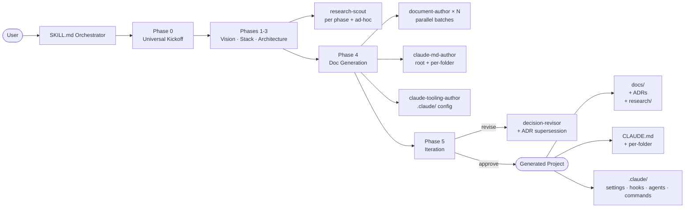

<!--
Author: Vladimir Dukelic <vladimir@dukelic.com>
Repository: https://github.com/siliconyouth/project-architect
License: MIT
-->

<p align="center">
  
</p>

<div align="center">

# project-architect

**An orchestrator skill that bootstraps any project end-to-end inside Claude Code.**

From _"I want to build X"_ to _"docs, CLAUDE.md, ADRs, and a `.claude/` config — all committed."_

[](LICENSE)
[](https://github.com/siliconyouth/project-architect/releases)
[](https://github.com/siliconyouth/project-architect)
[](https://github.com/siliconyouth/project-architect/commits/main)
[](.claude-plugin/plugin.json)

</div>

---

## What it does

`project-architect` is a Claude Code **orchestrator skill** that walks you through **9 phases** — from the elevator pitch to a fully-committed project with architecture docs, ADRs, per-folder `CLAUDE.md`, and a stack-aware `.claude/` configuration.

Under the hood it dispatches **5 specialized subagents** (research-scout, document-author, decision-revisor, claude-md-author, claude-tooling-author) in parallel where it's safe, files Architecture Decision Records as the interview progresses, and ends with an optional handoff to `superpowers:writing-plans` for an MVP implementation plan.

## Quick start

```bash
# 1. Add this marketplace to your Claude Code installation
claude plugin marketplace add siliconyouth/project-architect

# 2. Install the plugin
claude plugin install project-architect@siliconyouth

# 3. Verify (optional)
claude plugin validate

# 4. In a fresh project dir, start a Claude Code session and invoke
cd ~/your-new-project
claude
```

Then inside Claude:

```
/effort max
/model       → Opus 4.7 (1M context)
/project-architect
```

## What it looks like

**Preflight banner (silent on a healthy setup):**

```console
$ /project-architect

✓ Preflight (v2.1.0)
  ✓ Model: claude-opus-4-7[1m]   ✓ Effort: max
  ✓ Recommended plugins: 6/6
  ✓ Version freshness: current
  ✓ Cache hygiene: clean
```

**Universal Kickoff (3 batches of multi-choice questions):**

```console
Phase 0 — Universal Kickoff

? One-sentence elevator pitch:
› A CLI to convert markdown files to PDF.

? Top-level project type:
  ○ Web application
  ● CLI tool / Developer tool
  ○ Mobile application
  ○ Library / SDK / package
  ○ Claude Code plugin
  ... (14 more)

? Sub-type:
  ● Developer tool
  ○ System utility
  ○ Data/CSV tool
  ○ Package manager / Build tool / Scaffolder
  ...
```

**Research-augmented questioning (between phases):**

```console
[research-scout] Phase 0 domain research dispatched...
  → docs/research/phase0-domain.md  (3 similar projects, 5 pitfalls, 2 implications)

Implications for this project:
• Pandoc-based pipelines dominate; printpdf is the modern Rust-native alternative
• Bundle size matters for `cargo install` — keep static deps lean
• Most similar tools skip stdin → align (decision recorded in ADR 0003)
```

**Iteration menu (Phase 5):**

```console
✓ Bootstrap complete.

  ┌─ DECISIONS ────────────────────────────────────────────┐
  │  Tech stack                                              │
  │    • Language: Rust (ADR 0001)                          │
  │    • CLI framework: clap (ADR 0002)                     │
  │    • PDF: printpdf (ADR 0003)                           │
  │  Generated: 14 docs · 6 ADRs · 4 research findings      │
  └──────────────────────────────────────────────────────────┘

? What next?
  ● (a) Approve all → Phase 6
  ○ (b) Revisit a decision
  ○ (c) Snapshot current as v1.0
  ○ (d) Generate the implementation plan
  ○ (e) Show full decision tree
  ○ (f) Exit (resume later)
```

## Phases at a glance

| # | Phase | What happens |
|---|---|---|
| -1 | **Preflight** | Verify Opus 4.7 (1M context) at max effort. Auto-fix `.remember/logs/`. Check soft-deps. Compare cached version to latest release. Clean stale cache dirs. |
| 0a | **Repo Init** _(optional)_ | `git init` and optionally `gh repo create`. |
| 0 | **Universal Kickoff** | 3 batches of multi-choice questions (Q1–Q8). Classifies the project type. Dispatches the first research-scout. |
| 1 | **Vision & Scope** | Type-specific drill-down. Ad-hoc + end-of-phase research. |
| 2 | **Tech Stack** | Type-aware option presentation. ADR per major decision. End-of-phase research on stack gotchas. |
| 2.5 | **Cost Modeling** | Pricing research → `COST_MODEL.md` data. |
| 3 | **Architecture Deep Dive** | Per-area drill-downs + inline consistency check. |
| 4 | **Document Generation** | Parallel `document-author` × N + `claude-md-author` + `claude-tooling-author`. |
| 5 | **Iteration** | Decision-revisor loop, snapshot option, or proceed. |
| 6 | **Post-Generation Setup** | Plugin install offers, push, optional `cargo new` / `pnpm install`. |
| 7 | **Plan Handoff** _(optional)_ | Hand off to `superpowers:writing-plans` for MVP plan. |

## Architecture



## What it generates

```text
<your-project>/
├── CLAUDE.md                           ← root, loaded into every Claude session
├── apps/web/CLAUDE.md                  ← per-folder when conventions differ
├── packages/crypto/CLAUDE.md
├── .claude/
│   ├── settings.json                   ← model: opus 1M, stack-aware permissions, hooks
│   ├── hooks/                          ← lint-on-save, test-on-stop, dangerous-command guard
│   ├── agents/                         ← test-runner, migration-checker, deploy-verifier
│   ├── commands/                       ← /feature, /run-tests, /deploy-preview
│   └── recommended-plugins.md
└── docs/
    ├── PROJECT_OVERVIEW.md             ← master hub
    ├── PROJECT_REQUIREMENTS.md
    ├── AUTHENTICATION_SYSTEM.md        ← when auth.enabled
    ├── DATABASE_DESIGN.md              ← when DB present
    ├── API_GATEWAY.md                  ← when building an API
    ├── ... 40+ more conditional templates
    ├── decisions/                      ← ADRs, sequential, supersession-chain audit trail
    │   ├── 0001-language-runtime.md
    │   └── 0007-revisit-database-choice.md
    ├── research/                       ← findings from research-scout
    │   ├── phase0-domain.md
    │   └── phase2-stack-combination.md
    └── versions/                       ← snapshot bundles at milestones
        └── v1.0/
```

## Project types supported (18+)

- Web app (SaaS / marketplace / dashboard / e-commerce / community / wiki / newsletter / portfolio / internal tool)
- Mobile (consumer / B2B / enterprise / health / finance / productivity / media)
- Multi-platform system (web + mobile + desktop + API)
- API service (REST / GraphQL / gRPC / WebSocket / event-driven / webhook / proxy / scheduled)
- CLI tool (developer / system utility / data / network-security / package manager / build / scaffolder / REPL)
- Library / SDK (service SDK / framework / utility / type lib / FFI / code-gen / linter / test lib)
- Desktop (macOS / Windows / Linux / cross-platform / menu bar / system extension / daemon)
- Browser extension (Chrome / Firefox / Safari / cross-browser)
- Game (2D / 3D / mobile / web / console / VR-AR)
- AI/ML (training / inference / RAG / agents / vision / NLP / recommendation / time-series / RL / multi-modal)
- Data pipeline (batch / streaming / ETL / reverse-ETL / CDC / analytics / feature store)
- Embedded / IoT (Cortex-M / RP2 / ESP32 / STM32 / edge gateway / hardware combo)
- Infrastructure tool (IaC / CLI / IDP / cluster operator / observability / CI/CD)
- **Claude Code plugin** (commands / skills / agents / hooks / full)
- **MCP server** (stdio / HTTP-SSE / Cloudflare Workers / other)
- Web3 / smart contracts (EVM / Solana / Aptos-Sui / Starknet)
- Scientific computing (numerical / data analysis / reproducible / bio / GIS)
- AR / VR / spatial (visionOS / Quest / mobile AR / WebXR)

## Recommended plugins (Preflight auto-detects)

| Plugin | Role |
|---|---|
| `commit-commands` _(required)_ | Auto-commit cadence per batch / artifact / phase |
| `superpowers` | Optional Phase 7 handoff to `writing-plans` |
| `claude-md-management` | Audits the generated `CLAUDE.md` files |
| `claude-code-setup` | Source of stack → skill recommendations |
| `hookify` | Hook authoring patterns for generated `.claude/hooks/` |
| `document-skills` | Writing-quality conventions absorbed by `document-author` |
| `fewer-permission-prompts` | Tightens the generated `.claude/settings.json` permissions allowlist |

## Versioning policy

Every change bumps `plugin.json` and creates a matching tag. See [CHANGELOG.md](CHANGELOG.md) for the full history.

Procedure for maintainers:

```bash
# 1. Bump plugin.json
python3 -c "import json,sys; p='.claude-plugin/plugin.json'; d=json.load(open(p)); d['version']=sys.argv[1]; open(p,'w').write(json.dumps(d,indent=2)+'\n')" 2.1.1

# 2. Add a [<version>] block to CHANGELOG.md

# 3. Commit, tag, push
git add .claude-plugin/plugin.json CHANGELOG.md
git commit -m "chore(release): bump to 2.1.1"
git tag -a v2.1.1 -m "..."
git push origin main && git push origin v2.1.1

# 4. Refresh local cache (only needed if you're testing your own change locally)
claude plugin marketplace update siliconyouth
claude plugin uninstall project-architect@siliconyouth
claude plugin install project-architect@siliconyouth
```

Semver rules: **patch** = bug fix / doc / refactor; **minor** = backward-compatible feature; **major** = breaking change.

## Contributing

See [CONTRIBUTING.md](CONTRIBUTING.md) for the full workflow. PRs welcome; for substantial changes, open an issue first.

## Attribution

When you use `project-architect`, the generated docs end with:

> *✨ Skillfully made with [project-architect](https://github.com/siliconyouth/project-architect).*

This is a social-norm attribution — please keep it visible in `PROJECT_OVERVIEW.md`, `CLAUDE.md`, and other top-level docs so others can discover the tool. The MIT license doesn't legally require this, but it's a polite norm and costs you nothing.

If you fork the skill itself or build on top of it, the source-file attribution comments must remain per the MIT terms (the LICENSE file must be included in any redistribution).

## License

[MIT](LICENSE) — © 2026 Vladimir Dukelic / Silicon Youth.

## Source

This repo is its own Claude Code marketplace. The plugin manifest is at `.claude-plugin/plugin.json`; the orchestrator skill body is at `skills/project-architect/SKILL.md`; references and templates live under `skills/project-architect/references/`; subagents live under `agents/`.

The full v2.0 design spec is at [`docs/superpowers/specs/2026-05-12-project-architect-v2-redesign-design.md`](docs/superpowers/specs/2026-05-12-project-architect-v2-redesign-design.md) and the implementation plan at [`docs/superpowers/plans/2026-05-12-project-architect-v2-implementation.md`](docs/superpowers/plans/2026-05-12-project-architect-v2-implementation.md). Reading those is the fastest way to understand *how* it was built — and the strongest signal that this isn't a toy.
